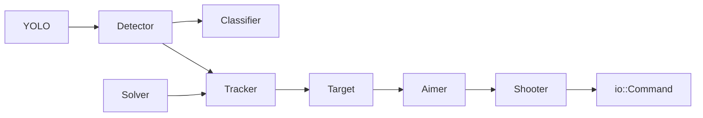
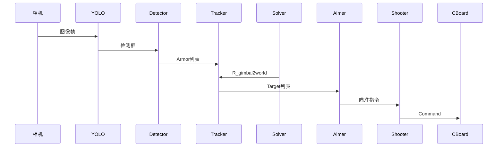

# RoboMaster SP_Vision 25 技术架构分析文档

> 同济大学SuperPower战队25赛季自瞄算法开源
>
> 分析版本：sp_vision_25
>
> 分析目的：系统化理解代码架构、核心模块、模块间依赖、数据流与文档

---

## 1 项目概述

本项目是RoboMaster机甲大师赛的视觉识别与瞄准系统。

**核心功能**：
- 自动瞄准（Auto Aim）：针对移动装甲板目标的自动瞄准和自动火控
- 打符（Buff）：能量机关的识别与击打
- 全向感知（Omniperception）：哨兵机器人的多方向感知能力

**技术亮点**：
- 无ROS依赖，模块化架构
- 自瞄轨迹规划算法
- 完整工作流：开发、编译、调试、部署

---

## 2 目录结构

```
sp_vision_25/
├── assets/              # 模型权重、演示素材
├── calibration/          # 标定程序
├── configs/              # YAML配置文件
├── io/                   # 硬件抽象层
│   ├── camera.cpp/hpp    # 相机基类
│   ├── cboard.cpp/hpp    # C板通信
│   ├── gimbal/           # 云台控制
│   ├── hikrobot/         # 海康相机SDK
│   ├── mindvision/       # MindVision相机SDK
│   ├── ros2/             # ROS2通信
│   ├── serial/           # 串口通信
│   └── usbcamera/        # USB相机
├── src/                  # 主程序入口
├── tasks/                # 核心视觉模块
│   ├── auto_aim/         # 自瞄模块
│   ├── auto_buff/        # 打符模块
│   └── omniperception/    # 全向感知
├── tests/                # 测试程序
└── tools/                # 通用工具
```

---

## 3 核心模块架构

### 3.1 自瞄模块 (auto_aim)

采用感知-决策-执行三层架构：



#### 核心组件

| 组件 | 头文件 | 功能 |
|------|--------|------|
| YOLO | `tasks/auto_aim/yolo.hpp` | 目标检测基类 |
| Detector | `tasks/auto_aim/detector.hpp` | 装甲板检测 |
| Classifier | `tasks/auto_aim/classifier.hpp` | 装甲板分类 |
| Tracker | `tasks/auto_aim/tracker.hpp` | 目标跟踪 |
| Solver | `tasks/auto_aim/solver.hpp` | 位姿解算 |
| Target | `tasks/auto_aim/target.hpp` | 目标状态 |
| Aimer | `tasks/auto_aim/aimer.hpp` | 瞄准决策 |
| Shooter | `tasks/auto_aim/shooter.hpp` | 发射控制 |

#### 装甲板数据结构 (armor.hpp)

```cpp
enum Color { red, blue, extinguish, purple };
enum ArmorType { big, small };
enum ArmorName { one, two, three, four, five, sentry, outpost, base, not_armor };

struct Lightbar {
    cv::Point2f center, top, bottom;
    double angle, length, width, ratio;
};

struct Armor {
    Color color;
    Lightbar left, right;
    cv::Point2f center;
    ArmorType type;
    ArmorName name;
    ArmorPriority priority;
    int class_id;
    double confidence;
};
```

#### 关键类接口

**Tracker::track()**
```cpp
std::list<Target> track(
    std::list<Armor>& armors,
    std::chrono::steady_clock::time_point t,
    bool use_enemy_color = true);
```

**Solver::solve()**
```cpp
void solve(Armor& armor) const;
void set_R_gimbal2world(const Eigen::Quaterniond& q);
```

**Aimer::aim()**
```cpp
io::Command aim(
    std::list<Target> targets,
    std::chrono::steady_clock::time_point timestamp,
    double bullet_speed,
    io::ShootMode shoot_mode,
    bool to_now = true);
```

---

### 3.2 打符模块 (auto_buff)

| 文件 | 功能 |
|------|------|
| `buff_detector.hpp` | Buff检测器 |
| `buff_solver.hpp` | Buff解算器 |
| `buff_aimer.hpp` | Buff瞄准器 |
| `buff_target.hpp` | Buff目标状态 |
| `buff_type.hpp` | Buff数据类型 |

---

### 3.3 全向感知模块 (omniperception)

| 文件 | 功能 |
|------|------|
| `perceptron.hpp` | 多相机并行感知 |
| `decider.hpp` | 目标优先级决策 |
| `detection.hpp` | 检测结果结构 |

---

## 4 IO模块

### 4.1 核心文件

| 文件 | 功能 |
|------|------|
| `io/camera.hpp` | 相机基类与工厂模式 |
| `io/cboard.hpp` | C板通信（IMU+指令） |
| `io/command.hpp` | 指令数据结构 |
| `io/socketcan.hpp` | CAN总线通信 |

### 4.2 指令结构 (command.hpp)

```cpp
struct Command {
    bool control;      // 是否接管控制
    bool shoot;        // 是否射击
    double yaw;         // yaw角度
    double pitch;       // pitch角度
    double horizon_distance;  // 无人机专用
};
```

### 4.3 CBoard数据流

```
CAN接收 --> IMUData{Quaterniond, timestamp}
         --> ThreadSafeQueue
         --> imu_at(timestamp) 线性插值
```

---

## 5 工具模块 (tools)

| 文件 | 功能 |
|------|------|
| `extended_kalman_filter.hpp` | 扩展卡尔曼滤波 |
| `pid.hpp` | PID控制器 |
| `math_tools.hpp` | 数学工具 |
| `img_tools.hpp` | 图像处理工具 |
| `thread_safe_queue.hpp` | 线程安全队列 |
| `thread_pool.hpp` | 线程池 |
| `plotter.hpp` | 数据绘图 |
| `logger.hpp` | 日志系统 |
| `recorder.hpp` | 数据录制 |

---

## 6 主程序入口 (src)

| 程序 | 描述 | 链接库 |
|------|------|--------|
| `standard.cpp` | 步兵标准程序 | auto_aim, auto_buff, tools, io |
| `mt_standard.cpp` | 步兵多线程版 | 同上 |
| `standard_mpc.cpp` | 步兵MPC版 | 同上 |
| `uav.cpp` | 无人机程序 | 同上 |
| `sentry.cpp` | 哨兵程序(ROS2) | auto_aim, omniperception, tools, io |
| `sentry_multithread.cpp` | 哨兵多线程版 | 同上 |
| `auto_buff_debug.cpp` | Buff调试程序 | auto_buff, tools, io |

---

## 7 哨兵主程序流程 (sentry.cpp)

```cpp
int main(int argc, char* argv[]) {
    // 初始化
    io::ROS2 ros2;
    io::CBoard cboard(config_path);
    io::Camera camera(config_path);
    
    auto_aim::YOLO yolo(config_path, false);
    auto_aim::Solver solver(config_path);
    auto_aim::Tracker tracker(config_path, solver);
    auto_aim::Aimer aimer(config_path);
    auto_aim::Shooter shooter(config_path);
    omniperception::Decider decider(config_path);
    
    while (!exiter.exit()) {
        // 1. 数据采集
        camera.read(img, timestamp);
        Eigen::Quaterniond q = cboard.imu_at(timestamp - 1ms);
        
        // 2. 自瞄核心
        solver.set_R_gimbal2world(q);
        auto armors = yolo.detect(img);
        decider.armor_filter(armors);
        auto targets = tracker.track(armors, timestamp);
        
        // 3. 决策
        io::Command command{false, false, 0, 0};
        if (tracker.state() == "lost")
            command = decider.decide(yolo, gimbal_pos, ...);
        else
            command = aimer.aim(targets, timestamp, ...);
        
        // 4. 发射
        command.shoot = shooter.shoot(command, aimer, targets, gimbal_pos);
        
        // 5. 发送
        cboard.send(command);
        ros2.publish(target_info);
    }
}
```

---

## 8 模块依赖关系

```
YOLO --> Detector --> Classifier
     \--> Tracker --> Target --> Aimer --> Shooter --> CBoard
                    ^
                    |
               Solver
```

**编译依赖**：
- auto_aim库 --> tools, io, OpenCV, Eigen, OpenVINO
- auto_buff库 --> tools, io, OpenCV, Eigen
- omniperception库 --> tools, io, OpenCV
- io库 --> tools, SocketCAN

---

## 9 配置文件结构 (sentry.yaml)

```yaml
# 敌方颜色
enemy_color: "blue"

# 神经网络参数
yolo_name: yolov5
yolo11_model_path: assets/yolo11.xml
yolov8_model_path: assets/yolov8.xml
device: GPU
min_confidence: 0.8
use_traditional: true

# ROI参数
roi: {x: 420, y: 50, width: 600, height: 600}
use_roi: false

# 相机参数
camera_name: "hikrobot"
exposure_ms: 0.8
gain: 16.9

# 传统方法参数
threshold: 150
max_angle_error: 45
min_lightbar_ratio: 1.5
max_lightbar_ratio: 20

# Tracker参数
min_detect_count: 5
max_temp_lost_count: 25

# Aimer参数
yaw_offset: -0.8
pitch_offset: -1
comming_angle: 60
leaving_angle: 20
decision_speed: 10

# 相机标定参数
camera_matrix: [...]
distort_coeffs: [...]
R_camera2gimbal: [...]
t_camera2gimbal: [...]
```

---

## 10 重要文件索引

### 核心业务逻辑

| 优先级 | 文件路径 | 说明 |
|--------|----------|------|
| ★★★ | `src/sentry.cpp` | 哨兵主程序，完整自瞄流程 |
| ★★★ | `tasks/auto_aim/tracker.cpp` | 目标跟踪核心 |
| ★★★ | `tasks/auto_aim/solver.cpp` | 位姿解算核心 |
| ★★★ | `tasks/auto_aim/aimer.cpp` | 瞄准决策核心 |
| ★★☆ | `tasks/auto_aim/detector.cpp` | 装甲板检测 |
| ★★☆ | `tasks/auto_aim/yolo.cpp` | YOLO检测封装 |

### IO通信

| 优先级 | 文件路径 | 说明 |
|--------|----------|------|
| ★★★ | `io/cboard.cpp` | C板通信，IMU+指令 |
| ★★☆ | `io/camera.cpp` | 相机抽象 |
| ★★☆ | `io/socketcan.hpp` | CAN总线 |

### 工具模块

| 优先级 | 文件路径 | 说明 |
|--------|----------|------|
| ★★★ | `tools/extended_kalman_filter.hpp` | EKF状态估计 |
| ★★☆ | `tools/math_tools.cpp` | 坐标变换 |
| ★★☆ | `tools/thread_safe_queue.hpp` | 线程安全队列 |

---

## 11 数据流总图



---

## 12 开发调试建议

### 12.1 模块独立测试

项目提供各模块独立测试程序：
- `tests/auto_aim_test.cpp` - 自瞄模块测试
- `tests/auto_buff_test.cpp` - 打符模块测试
- `tests/camera_test.cpp` - 相机测试
- `tests/detector_video_test.cpp` - 检测器离线测试

### 12.2 调试工具

- **PlotJuggler**：绘制调试曲线（yaw、pitch、击打状态）
- **NoMachine**：远程桌面连接机器人
- **Recorder**：录制时间戳+视频+四元数数据

### 12.3 扩展开发流程

1. 在对应模块添加新类/函数
2. 使用tests/下现有测试程序验证
3. 在src/下创建或修改主程序
4. 更新configs/配置文件
